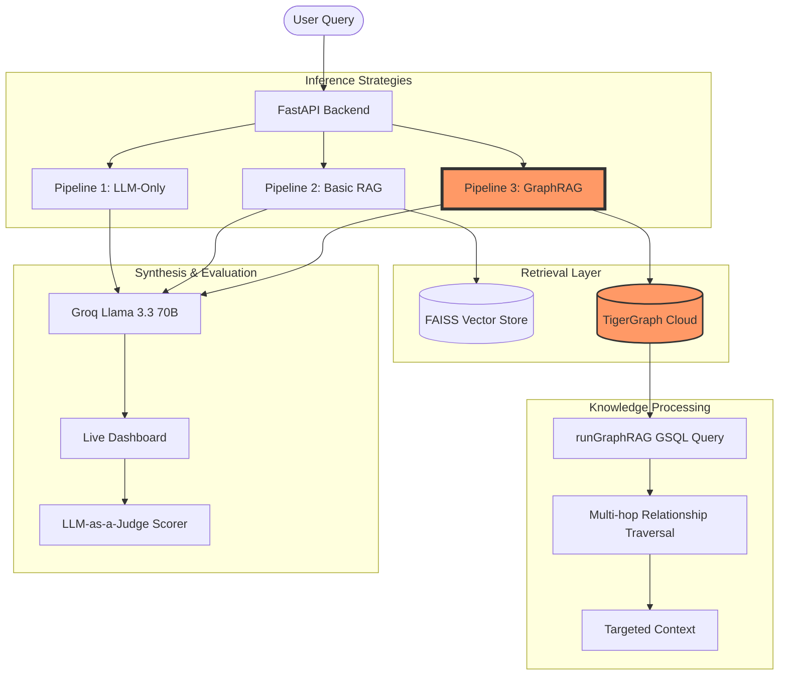

# 🏗️ SavannaFlow // GraphRAG Inference Engine: Architecture

The following diagram illustrates the high-performance inference pipeline designed for the TigerGraph Savanna Hackathon.

## 🛠️ Components Detail

### **1. GraphRAG Strategy (TigerGraph)**
- **Auth**: Implements the Savanna 4.x `GSQL-Secret` handshake to securely bridge external Python clients with the graph cluster.
- **Traversal**: Instead of simple keyword matching, it follows edges between `Mission`, `Spacecraft`, and `Crew` nodes to answer complex multi-hop questions.

### **2. LLM Synthesis (Groq)**
- Uses the `llama-3.3-70b-versatile` model on Groq's LPUs for sub-second response generation.

### **3. Accuracy Scoring**
- **LLM-as-a-Judge**: Uses an independent LLM to evaluate if the answer matches the retrieved context.
- **Performance Tracking**: Calculates real-time token cost and latency to prove the "3x Efficiency" of GraphRAG.
