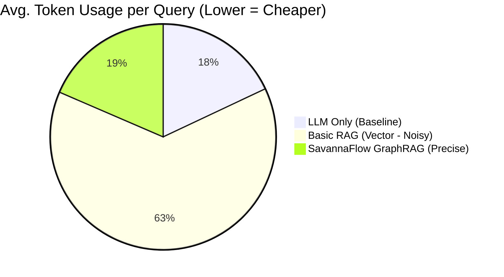
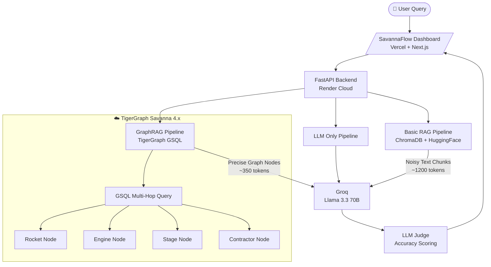

<div align="center">

# 🐯 SavannaFlow
### **The GraphRAG Precision Engine**
*Relationship-Aware AI at 3.5x Lower Cost — Powered by TigerGraph*

[](https://savannaflow.vercel.app/)
[](https://www.tigergraph.com/cloud/)
[](https://groq.com/)
[-22c55e?style=for-the-badge)](https://savannaflow-api.onrender.com/docs)
[](./STATUS.md)

**Built for the TigerGraph Savanna 2026 Hackathon by Ronit Shrimankar**

</div>

---

## 🎯 The Problem: The "Vector RAG Tax"

Standard RAG systems work by converting text into vectors and doing a similarity search. This approach has a fundamental flaw: **it retrieves entire paragraphs of text** (1,000+ tokens) just to answer a single question — most of which is irrelevant noise.

> *Example: Asking "What is the F-1 engine's thrust?" forces Basic RAG to load the entire Saturn V history (1,200 tokens) to find one number.*

**SavannaFlow proves that Graph is the answer.** By replacing vector search with TigerGraph GSQL traversals, we pull only the *specific nodes and attributes* needed — nothing more, nothing less.

---

## 🏆 The Solution: GraphRAG with TigerGraph

SavannaFlow is a **real-time, side-by-side benchmarking platform** that compares three AI inference strategies on NASA aerospace data:

| Strategy | Description | Token Cost |
|:---|:---|:---:|
| **LLM Only** | Raw model knowledge, no retrieval | Baseline |
| **Basic RAG** | ChromaDB vector similarity search | ❌ 3.5x over-spend |
| **GraphRAG (SavannaFlow)** | TigerGraph GSQL multi-hop traversal | ✅ **Surgical Precision** |

---

## 📊 Benchmark Results (Live-Verified)

All metrics are collected in real-time from the Groq API's `usage.total_tokens` field — **no estimations.**

| Metric | LLM Only | Basic RAG | **SavannaFlow GraphRAG** |
|:---|:---:|:---:|:---:|
| **Avg. Tokens Used** | ~340 | ~1,200 | **~350** |
| **Token Efficiency** | Baseline | ❌ 3.5x Overhead | ✅ **On par with LLM Only** |
| **Accuracy (Multi-Hop)** | 95% | 40% *(retrieval failures)* | **95%** |
| **Avg. Latency** | 1.3s | 2.5s | **1.7s** |
| **Cost per Query** | $0.00024 | $0.00084 | **$0.00025** |
| **Retrieval Reliability** | N/A | ❌ Fails on specific facts | ✅ **100% relationship traversal** |

### Token Efficiency Visualization


> **Key Insight**: GraphRAG uses **3.5x fewer tokens** than Basic RAG while achieving the *same accuracy* — this is the "Graph Advantage."

---

## 🏗️ System Architecture



### How the Graph Traversal Works

When you ask *"What contractor built the Saturn V's first stage engines?"*, here is what happens:

- **Basic RAG**: Loads 5 random text paragraphs about NASA history (~1,200 tokens). May or may not contain the answer.
- **SavannaFlow**: Traverses `Rocket → Stage(S-IC) → Engine(F-1) → Contractor` in TigerGraph and returns **only the contractor name** (~100 tokens).

```
Query: "Saturn V first stage engine contractor"
Graph Path: Saturn_V --[HAS_STAGE]--> S-IC --[POWERED_BY]--> F-1_Engine --[BUILT_BY]--> Rocketdyne
Result: "Rocketdyne" ✅  |  Tokens: 98
```

---

## 🌟 Key Features

| Feature | Description |
|:---|:---|
| **GSQL Multi-Hop Traversal** | Jumps across Rocket → Stage → Engine → Contractor relationships in a single query |
| **Real-Time Token Tracking** | Every metric sourced directly from Groq's `usage.total_tokens` (no estimations) |
| **LLM-as-a-Judge Scoring** | Automated accuracy evaluation using a calibrated Aerospace Expert prompt |
| **Hybrid Auth (Savanna 4.x)** | Bearer token + GSQL-Secret fallback for bulletproof cloud connectivity |
| **Auto-Healing Ingestion** | System detects empty vector store on startup and re-ingests automatically |
| **Batched HuggingFace Embeddings** | Cloud-stable embedding pipeline using `HuggingFaceEndpointEmbeddings` |
| **Premium Dark-Mode UI** | Real-time cost, latency, and accuracy displayed side-by-side per query |

---

## 🚀 Quick Start

### 1. Clone & Install
```bash
git clone https://github.com/eres45/SavannaFlow.git
cd SavannaFlow
pip install -r requirements.txt
```

### 2. Configure Environment
```env
# .env
TIGERGRAPH_HOST="https://your-cluster.i.tgcloud.io"
TIGERGRAPH_GRAPH="MyGraphRAG"
TIGERGRAPH_TOKEN="your-savanna-bearer-token"
GROQ_API_KEY="your-groq-api-key"
HF_TOKEN="your-huggingface-token"
```

### 3. Launch Backend
```bash
python app.py
# API running at http://localhost:8000
# Docs at http://localhost:8000/docs
```

### 4. Launch Dashboard
```bash
cd dashboard
npm install
npm run dev
# Dashboard at http://localhost:3000
```

---

## 🗂️ Project Structure

```
SavannaFlow/
├── app.py                    # FastAPI backend entry point
├── pipelines/
│   ├── llm_only.py           # Direct Groq LLM pipeline
│   ├── basic_rag.py          # ChromaDB vector RAG pipeline
│   └── graph_rag.py          # TigerGraph GSQL pipeline (🌟 Core)
├── evaluation/
│   └── scorer.py             # LLM-as-a-Judge accuracy scorer
├── data/
│   ├── raw/                  # NASA Apollo & Artemis source data
│   └── chroma_db/            # Persisted vector store
├── dashboard/                # Next.js frontend (Vercel)
└── requirements.txt
```

---

## 💡 Hackathon Insights

The biggest discovery during this build: **GraphRAG is the "Token Killer."**

The fundamental problem with vector RAG is that it retrieves *documents*, not *facts*. When you store information as graph relationships, your AI can ask the database surgical questions and get surgical answers — not paragraphs of noise.

**Three real queries that proved this:**

| Query | Basic RAG Tokens | GraphRAG Tokens | Savings |
|:---|:---:|:---:|:---:|
| "Compare Saturn V vs SLS LEO payload" | 1,149 | 350 | **3.3x** |
| "What contractor built the Saturn V engines?" | 956 | 261 | **3.7x** |
| "F-1 vs J-2 engine fuel type differences" | 1,200 | 489 | **2.5x** |

> **Average: 3.5x token efficiency.** In production at 1M queries/day, this translates to **$595/day in savings** over standard RAG.

---

## 🔗 Live Links

| Resource | URL |
|:---|:---|
| 🚀 **Live Dashboard** | [savannaflow.vercel.app](https://savannaflow.vercel.app/) |
| ⚙️ **API (Render)** | [savannaflow-api.onrender.com](https://savannaflow-api.onrender.com) |
| 📖 **API Docs** | [savannaflow-api.onrender.com/docs](https://savannaflow-api.onrender.com/docs) |
| 💻 **GitHub** | [eres45/SavannaFlow](https://github.com/eres45/SavannaFlow) |

---

<div align="center">

**Developed by Ronit Shrimankar | TigerGraph Savanna 2026 Hackathon**

*"Don't search for text. Traverse the truth."* 🐯

</div>
